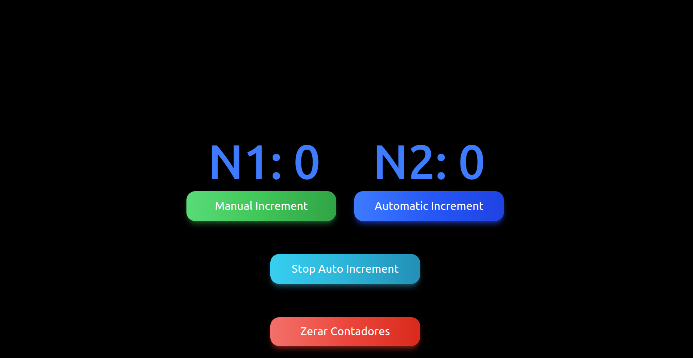

# 🔢 Incrementador

Aplicação criada com **Next.js** e **React** que simula um sistema de incrementos manuais e automáticos com interface interativa e responsiva.

---

## 🖼️ Preview



---

## 🚀 Funcionalidades

- ✅ Incremento manual de `N1` com delay de 1 segundo.
- ✅ Incremento automático de `N1` a cada 1 segundo.
- ✅ Cálculo automático de `N2` com base em `N1` (com atualização reativa).
- ✅ Reset/Zerar contadores `N1` e `N2`.
- ✅ Botões estilizados com feedback visual (pressionado).
- ✅ Animações suaves com Tailwind CSS.
- ✅ Separação por componentes e hook customizado.

---

## 🧠 Tecnologias Utilizadas

- [Next.js](https://nextjs.org/)
- [React](https://reactjs.org/)
- [TypeScript](https://www.typescriptlang.org/)
- [Tailwind CSS](https://tailwindcss.com/)

---

## 📁 Estrutura de Pastas

📦 app ┣ 📂 homeview ┃ ┗ 📜 HomeView.tsx ┣ 📜 layout.tsx ┣ 📜 page.tsx ┣ 📦 components ┃ ┗ 📜 IncrementadorComponents.tsx ┣ 📦 hooks ┃ ┗ 📜 Incrementador.ts ┣ 📦 props ┃ ┣ 📜 ButtonProps.ts ┃ ┗ 📜 DisplayProps.ts ┣ 📜 globals.css ┣ 📜 preview.png

---

## ⚙️ Como rodar o projeto localmente

1. **Clone o repositório**:
   ```bash
   git clone https://github.com/MaiconMJS/Incrementador.git
   cd incrementador
   npm install
   npm run dev
   ```
